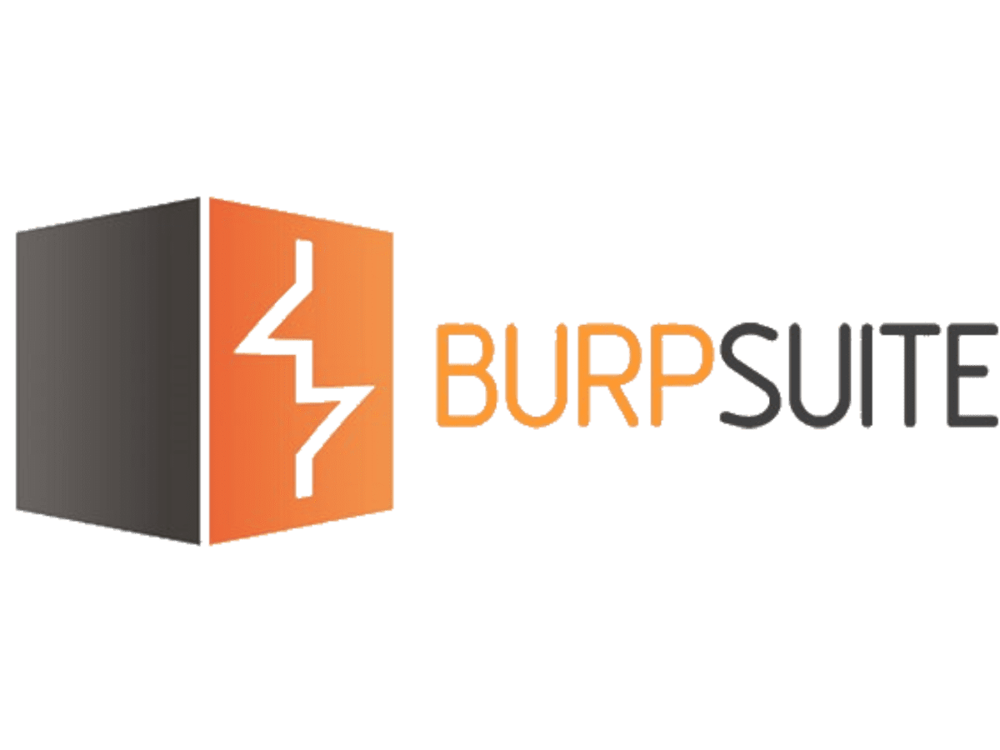
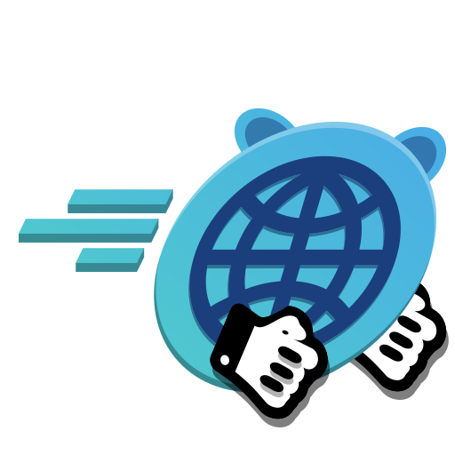
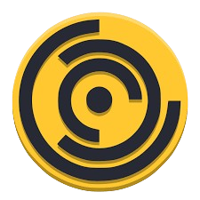
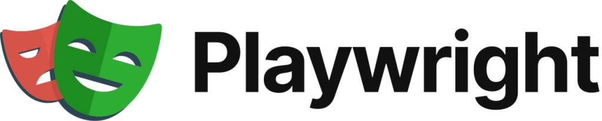

<h1 align="center">👋 Welcome, I'm Muhammad Usama</h1>
<h3 align="center">Cybersecurity Instructor | Penetration Tester | Ethical Hacker | OSINT Analyst | Developer</h3>
<h4 align="center">🛡️ Certified: CEH v11, CEH v12, OSCP, CISO | BS Cyber Security - HITEC University</h4>

  

---

## 🚀 About Me

🔐 I specialize in **penetration testing**, **threat mitigation**, **vulnerability analysis**, and **AI-powered security automation**.

🧠 I mentor aspiring cybersecurity professionals and conduct real-world offensive security assessments to fortify digital infrastructures.

💬 Ask me about:
- Network & Web App Pentesting  
- OSINT & Threat Intelligence  
- Malware Analysis  
- Red Team Operations  
- Ethical Hacking Methodologies  

📫 **Connect with me**:  
[LinkedIn](https://www.linkedin.com/in/UsamaMatrix/) | [GitHub](https://github.com/UsamaMatrix) | [Twitter](https://twitter.com/UsamaMatrix)

⚡ **Fun Fact**: _"Hacking is not a crime when it's for defense. I hack to protect, not to destroy."_

---

## 🎓 Education & Professional Certifications

- 🎓 **BS in Cyber Security** – [HITEC University, Taxila](https://www.hitecuni.edu.pk/)
- 📜 **Certifications**:
  - CEH v11 & v12 – EC-Council  
  - OSCP – Offensive Security  
  - CISO – Chief Information Security Officer  
  - Advanced Graphic Design (Plus)
  - Additional industry credentials in Red Teaming, Forensics, and Secure Code Review

---

## 🌐 Digital Footprint

---

## 💻 Tech Stack

### 🖥️ Languages & Scripting

  
  
  
  
  
  

---

### 🛠️ Tools & Frameworks

  
  
  
  
  
  
  
  
  
  

---

## 📊 GitHub Stats

  
  

---

## 🚧 Featured Projects

- **🔐 [Penetration Testing Scripts](https://github.com/UsamaMatrix/penetration-testing-scripts)**  
  A curated library of scripts for ethical hacking and security testing.

- **🧠 [Adaptive AI Security](https://github.com/UsamaMatrix/adaptive-ai-security)**  
  Research project exploring AI-based threat detection & mitigation.

- **📖 [Cybersecurity Blog](https://github.com/UsamaMatrix/cybersecurity-blog)**  
  Tutorials, CTF write-ups, and expert advice for ethical hackers.

---

## ✍️ Articles & Thought Leadership

- 📝 [How I Got Started in Penetration Testing](https://usamatrix.medium.com)  
- 🔍 [Why Threat Intelligence Is Essential in Modern Security](https://usamatrix.medium.com)

---

## 🤝 Let’s Collaborate

I'm open to:
- 🔍 Cybersecurity consulting  
- 🧪 Penetration testing gigs  
- 🎙 Guest lectures and mentorships  
- 🤖 AI-Security research partnerships  

> ⚔️ *“Security is a mindset — not a toolset.”*  
> — Muhammad Usama
